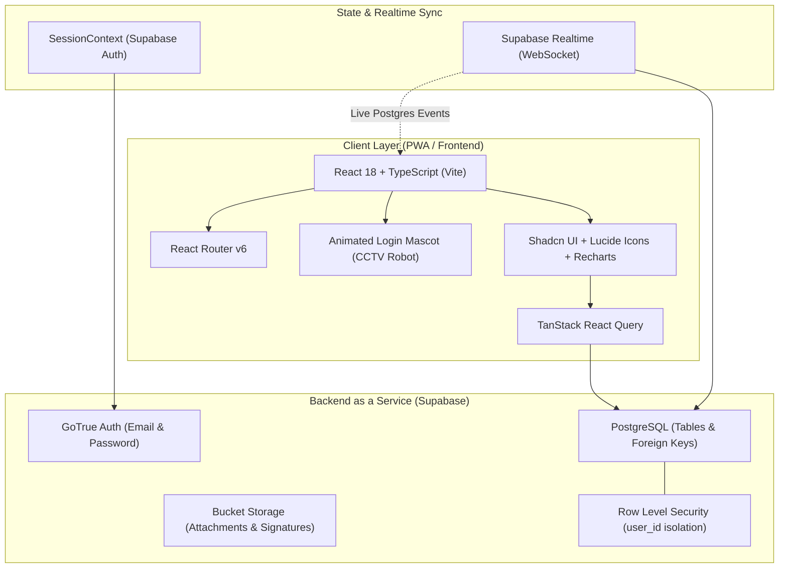
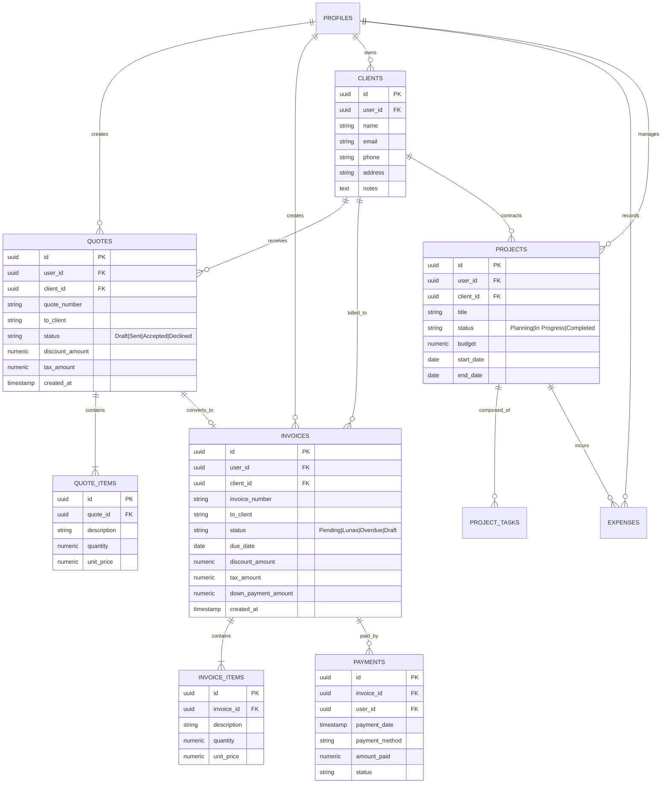
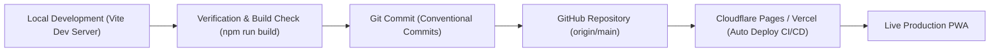

# 📐 Dokumen Desain Sistem & Arsitektur Aplikasi (DESIGN.md)
**Aplikasi**: QuoteApp (Sistem Manajemen Penawaran, Faktur, Proyek & Keuangan Bisnis)  
**Versi**: 2.5.0  
**Stack Utama**: React 18, TypeScript, Tailwind CSS, Shadcn UI, Supabase (PostgreSQL + Realtime), Vite PWA  

---

## 1. 🌟 Ringkasan Produk & Visi Arsitektur

**QuoteApp** adalah aplikasi berbasis web progresif (PWA) *modern*, responsif, dan *realtime* yang dirancang untuk membantu pemilik bisnis, kontraktor, konsultan, dan tim operasional dalam mengelola seluruh siklus transaksi bisnis mulai dari pembuatan penawaran harga (*quotations*), penerbitan faktur (*invoices*), pelacakan kas & pembayaran (*payments*), manajemen laba-rugi proyek, hingga analisis performa keuangan secara komprehensif.

### Nilai Utama (*Core Value Proposition*)
- **Sinkronisasi Realtime Tanpa Lag**: Setiap perubahan status atau penghapusan data langsung memutakhirkan metrik finansial, grafik analitik, dan tabel secara instan via Supabase Realtime.
- **Integritas Relasional Bersih**: Penghapusan entitas induk (seperti penawaran atau faktur) secara otomatis membersihkan item relasional (*cascading cleanup*) tanpa meninggalkan data yatim (*orphaned records*).
- **Desain UI/UX Premium & Kohesif**: Tampilan konsisten (*unified card styling*), ramah perangkat bergerak (*mobile-optimized 2-column KPI grid*), serta maskot otentikasi interaktif berteknologi tinggi.
- **PWA Siap Pakai & Responsif**: Mendukung instalasi di perangkat seluler (*add to home screen*) dengan caching aset offline.

---

## 2. 🏛️ Arsitektur Sistem & Diagram Alur



---

## 3. 📊 Diagram Relasi Entitas Data (ERD)



---

## 4. 🧩 Modul Fitur Aplikasi

### 1. Executive Dashboard (Business Command Center)
- **KPI Realtime**: Total Pendapatan, Penagihan Berjalan (*Pending Invoices*), Tingkat Konversi Penawaran (*Win Rate %*), dan Total Laba Bersih.
- **Kesehatan Dokumen (*Document Health*)**: Visualisasi diagram donat berbasis data riil tanpa mock fallback.
- **Top Klien Kontributor**: Grafik batang perolehan nilai transaksi terbesar per klien.
- **Tren Arus Kas Bulanan**: Area chart perbandingan pendapatan vs pengeluaran tahun berjalan.

### 2. Penawaran Harga (*Quotation Management*)
- **Multi-Status Lifecycle**: `Draft` ➔ `Terkirim` ➔ `Diterima (Won)` / `Ditolak (Lost)`.
- **Fitur Pembuatan Fleksibel**: Perhitungan diskon, PPN/pajak kustom, catatan khusus (*terms of service*), tanda tangan digital, dan lampiran.
- **Ekspor Dokumen**: Cetak langsung (*print*) atau unduh PDF beresolusi tinggi dengan template formal.
- **Konversi 1-Klik**: Mengubah penawaran yang disetujui langsung menjadi faktur tagihan (*Invoice*).

### 3. Faktur & Manajemen Kas (*Invoicing & Cash Flow*)
- **Pelacakan Jatuh Tempo**: Peringatan otomatis untuk faktur mendekati tempo atau *Overdue*.
- **Uang Muka & Pelunasan Bertahap**: Mendukung sistem pembayaran Down Payment (DP) dan pencatatan riwayat tanda terima pelunasan manual.
- **Realtime Settlement**: Perubahan status faktur langsung memutakhirkan tabel laporan laba rugi dan daftar kas masuk.

### 4. CRM & Database Klien (*Client Management*)
- **Sinkronisasi Otomatis (*Auto-Harvesting*)**: Klien baru yang diinput pada penawaran/faktur otomatis terdaftar di database CRM.
- **Profil Lengkap Klien**: Menampilkan riwayat transaksi, seluruh faktur/penawaran aktif, total perputaran omzet (*total invoiced vs paid*), serta log catatan khusus.

### 5. Laba Rugi & Pengeluaran (*Profit & Loss, Expenses*)
- **Manajemen Beban Usaha**: Kategori pengeluaran operasional, bahan baku, gaji, dan biaya tak terduga.
- **Laporan Profitabilitas**: Margin laba bersih per proyek dan per periode waktu.

### 6. Maskot Otentikasi Cerdas (*Interactive Security Robot Mascot*)
- **Desain Robot CCTV Otentik**: Aset karakter kamera pengawas beresolusi tinggi dengan latar belakang 100% transparan.
- **Eye Cursor Tracking**: Lensa mata biru bercahaya (*cyan glow*) menoleh dan bergerak dinamis mengikuti posisi kursor saat mengetik email.
- **Mechanical Privacy Shutter (Tutup Mata)**: Shutter mekanik otomatis menutup lensa dengan ekspresi `◠` saat pengguna memasukkan kata sandi.
- **Peeking Mode**: Shutter membuka celah horizontal dengan kilauan mata saat tombol *lihat kata sandi* ditekan.

---

## 5. 🎨 Sistem Desain & Antarmuka (UI/UX Design System)

### Palet Warna (*Color Tokens*)
- **Background Utama**: `bg-slate-950` / `bg-background` (Dark theme modern).
- **Surface Cards**: `bg-slate-900/90` dengan efek `backdrop-blur-2xl` dan border `border-slate-800/80`.
- **Aksen Primer**: `teal-500` / `cyan-400` (Simbol profesionalisme, ketelitian, dan teknologi finansial).
- **Aksen Sukses / Lunas**: `emerald-500` (Status `Lunas` / `Accepted`).
- **Aksen Peringatan / Jatuh Tempo**: `amber-500` (Status `Pending` / `Due Soon`).
- **Aksen Bahaya / Ditolak**: `rose-500` (Status `Declined` / `Overdue`).

### Grid & Tipografi Responsif
- **Header & Angka Finansial**: Font sans-serif tebal dengan atribut `tabular-nums` untuk perataan angka monospaced yang presisi.
- **Mobile Grid**: Sistem 2 kolom pada layar sempit (`grid-cols-2 gap-3 sm:grid-cols-4 sm:gap-4`) untuk memaksimalkan ruang layar smartphone tanpa pemotongan teks.

---

## 6. 🚀 Kebijakan Keamanan & RLS (Row Level Security)

Setiap tabel database PostgreSQL di Supabase menerapkan proteksi **Row Level Security (RLS)** dengan isolasi data tingkat pengguna:

```sql
-- Contoh Kebijakan RLS Isolasi Pengguna pada Quotes
ALTER TABLE public.quotes ENABLE ROW LEVEL SECURITY;

CREATE POLICY "Users can only access their own quotes" 
ON public.quotes
FOR ALL 
USING (auth.uid() = user_id)
WITH CHECK (auth.uid() = user_id);
```

---

## 7. 📦 Alur Rilis & Deployment Pipeline



---

*Dokumen ini dirawat sebagai standar acuan arsitektur dan pengembangan fitur aplikasi QuoteApp.*
